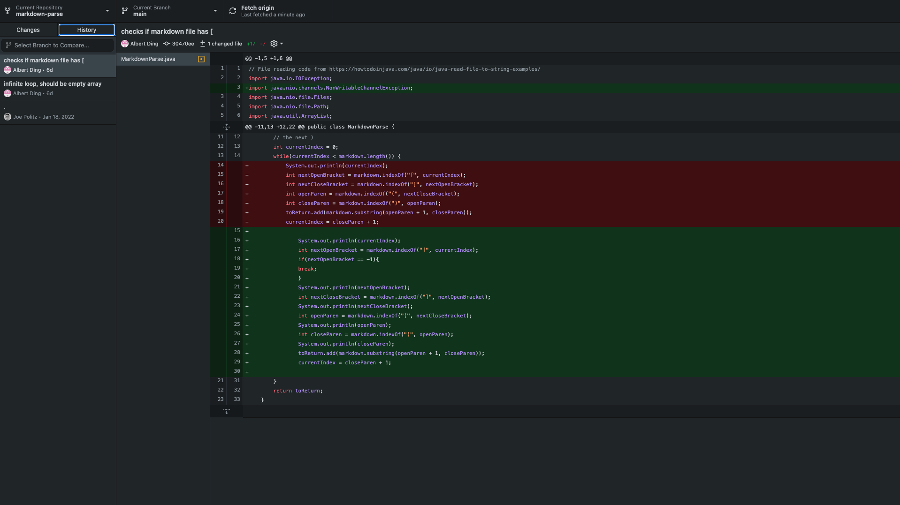
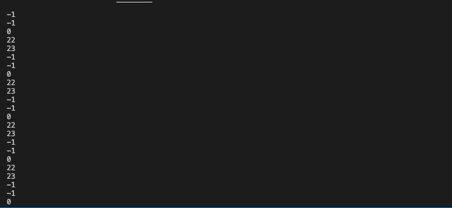
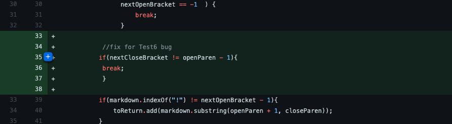
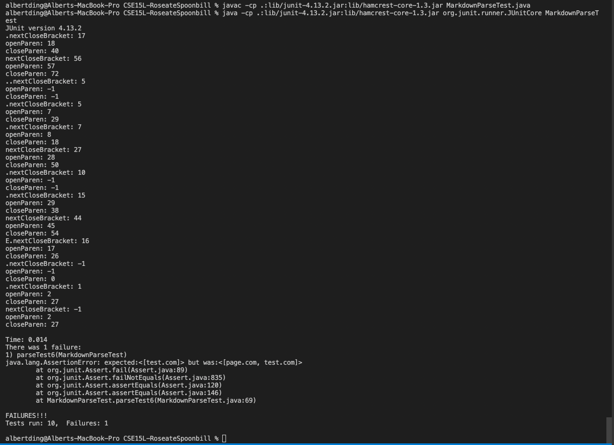
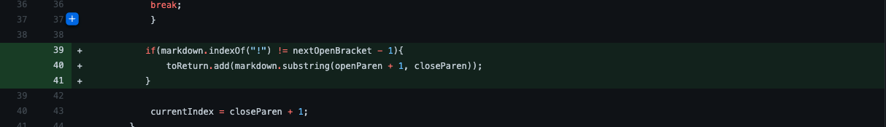
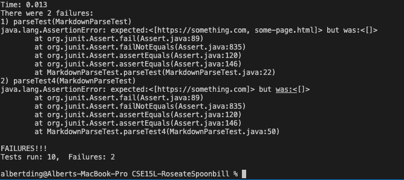

# Incremental Porgramming Testing, and Debugging

**Code change 1: Checking For Brackets**

Symptom:

Failure inducing [Test File](https://github.com/AlbertXDing/markdown-parse/blob/main/test-file2.md)

If the input file does not have the brackets, the while loop becomes an infinite loop. This was because `closeParen` would always be -1 and `currentIndex` would therefore never be greater than `markdown.length()`. This was fixed by checking to make sure the file had brackets in it.

**Code change 2: Making Sure Parenthesis Come Right After Brackets**

Symptom:

Failure inducing [Test File](https://github.com/AlbertXDing/CSE15L-RoseateSpoonbill/blob/main/test-file6.md)

MarkdownParse was recording links that did not immediately follow brackets. This was fixed by checking if the opening parenthesis immediately followed closing brackets.

**Code change 3: Checking For Images**

Symptom:

Failure inducing [Test File](https://github.com/AlbertXDing/CSE15L-RoseateSpoonbill/blob/main/test-file4.md)

MarkdownParse could not distinguish between links and images. This was fixed by checking for `!` before brackets, and skipping the parenthesis right after. 

