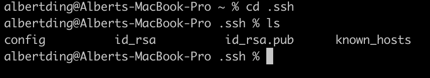
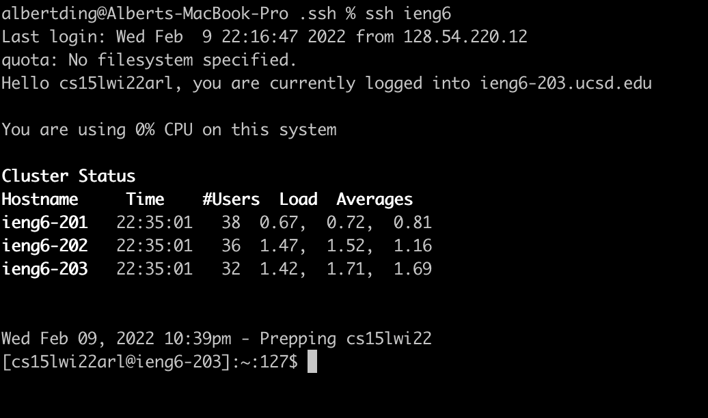

# Streamlining ssh Configuration
In order to save some typing, you can put an entry in the `~/.ssh/config` file that tells SSH what username to use when logging into specific servers. You can even give nicknames for the servers.

On your local machine, go to your `~/.ssh` directory. If you don't have the directory, create with the `mdkir .ssh` command.

Next, created a `config` file in `.ssh` which contains the following text (change the username to your own username):

This file is created and edited with the command `vi config`. Once you are in `vi` mode, you can edit the file by pressing `i`, and save your changes by pressing `esc` and typing `:wq`. 

This `~/.ssh/config` file allows you to `ssh` into your `ieng6` account by only typing `ssh ieng6` in the terminal.

This also allows you to `scp` files from your local machine to the server. For example,  a file called `lab3` was copied to the home directory of `ieng6` using the command `scp lab3 ieng6:~/`, as shown below:

