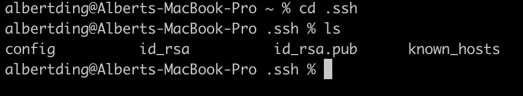
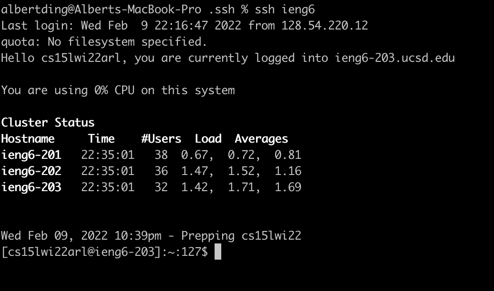

# Streamlining ssh Configuration

I created a `config` file in `.ssh` which contains the following text:

This display is shown with `vi config`

I can edit this file by pressing `i`, and save my changes by pressing `esc` and typing `:wq`. This allows me to `ssh` into my `ieng6` account by only typing `ssh ieng6` in my terminal.

This also allows you to scp files from your client to a server, as shown below.

A file called `lab3` was copied to the home directory of `ieng6` using the command `scp lab3 ieng6:~/`.