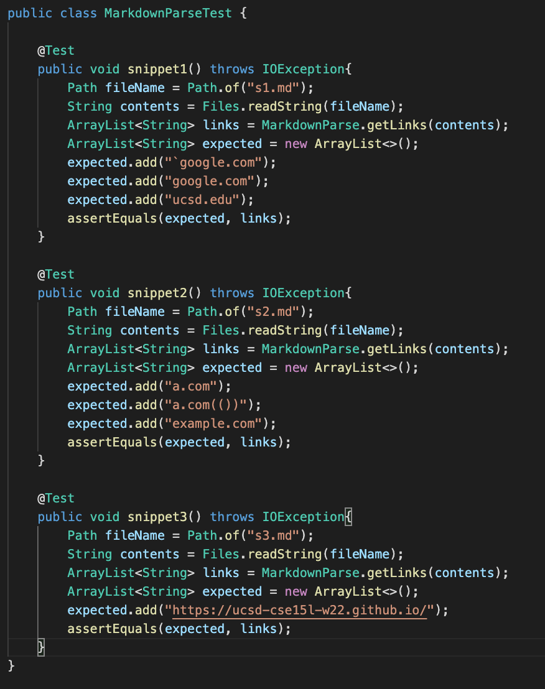
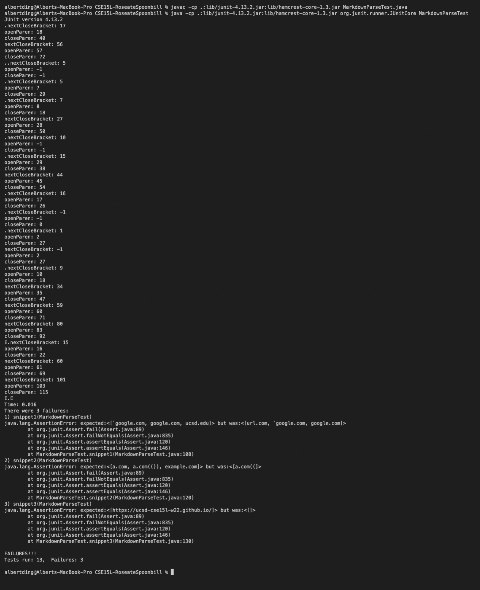
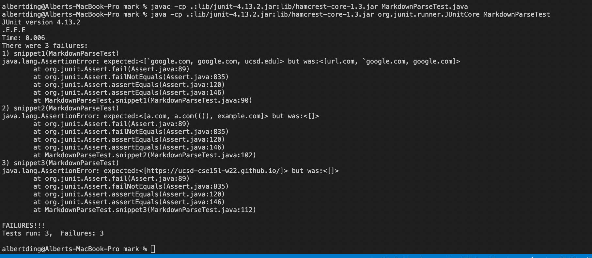

# Lab Four

[My repository](https://github.com/AlbertXDing/CSE15L-RoseateSpoonbill)

[Repository I'm reviewing](https://github.com/AlbertXDing/markdown-parse) 

**What the snippets should preduce**

Snippet 1:

[`google.com, google.com, ucsd.edu]

Snippet 2:

[a.com, a.com(()), example.com]

Snippet 3:

[https://ucsd-cse15l-w22.github.io/]

**Tests**

**Test Outputs**

My tests:

The bug in snippit 1 can be fixed by making sure any brackets are not counted within backticks. This can be done by recording the index of the backticks, and an if statement within a loop that negates brackets between those indexes.

The bug in snippit 2 can be fixed by searching for the last `)` in the line. Markdownparse also needs to identify `/{`.

Snippit 3 can be fixed by looking for brackets and parenthesis that span multiple lines but do not have line breaks.

The tests I am reviewing:

