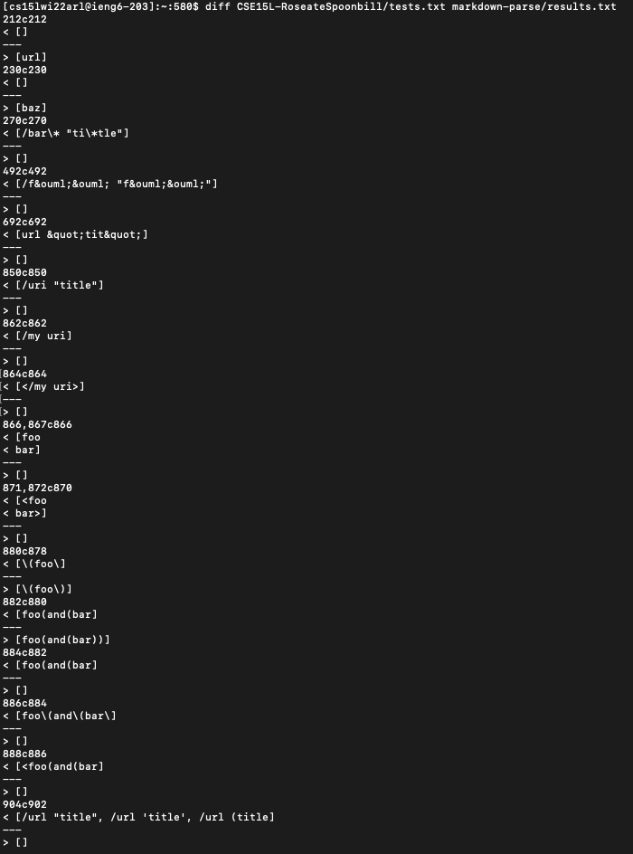
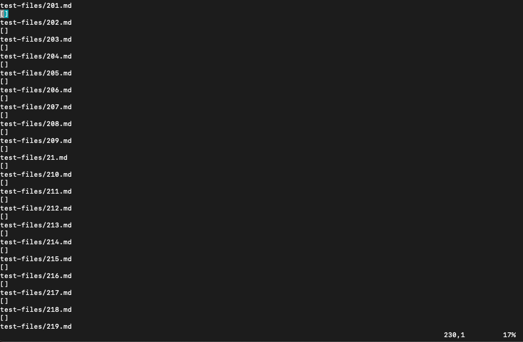
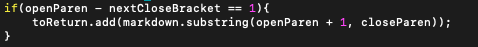
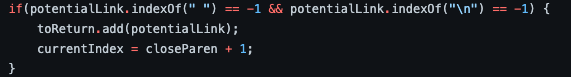

**Lab 5**

I found tests with different results using this command :

`diff CSE15L-RoseateSpoonbill/tests.txt markdown-parse/results.txt `



Difference 1:

The first difference is on line 230 for file `tests.txt`. This shows that a difference was on test file `201.md`:

```
[foo]: <bar>(baz)

[foo]
```




I believe my implementation is correct. The provided MarkDownParse does not check if the parenthesis following brackets is directly after the brackets. It needs a code block like this: 



Difference 2:

The second difference is on Line 270, showing a difference in `22.md`:

`[foo](/bar\* "ti\*tle")`

Once again, I believe that my implemenation is correct. I think the space in the link is throwing off the provided code:

